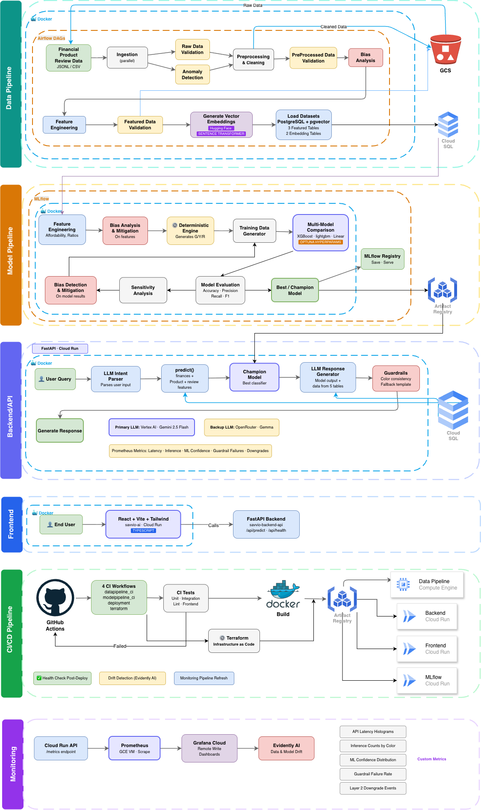

# SavVio

An AI-driven financial advocacy tool designed to bridge the gap between e-commerce and personal finance. SavVio serves as a "Financial Fiduciary" that evaluates whether a user should make a purchase based on their real-time financial health and the product's quality and utility.

## Project Overview

SavVio is a comprehensive MLOps project that integrates real-time product data with sensitive financial streams to provide responsible, conversational shopping guidance. Unlike traditional shopping assistants that focus on maximizing conversion, SavVio evaluates purchases based on:

- **Financial Health**: User's income, expenses, savings, and debt obligations.
- **Product Utility**: Analysis of product specifications, quality and real-world usefulness.
- **Decision Engine**: Generates final recommondation based on user's financial health and the product's utility.

The system provides Green/Yellow/Red light recommendations before users complete their purchase.

## Live Deployment (Production)

| Component | Status | Service | URL |
|-----------|--------|---------|-----|
| Frontend UI | Live | React / Vite / Tailwind | [https://savvio-ai-ebw2ryzjkq-ue.a.run.app](https://savvio-ai-ebw2ryzjkq-ue.a.run.app) |
| Inference API | Live | FastAPI / uvicorn | [https://savvio-backend-api-ebw2ryzjkq-ue.a.run.app](https://savvio-backend-api-ebw2ryzjkq-ue.a.run.app) |
| Model Registry | Live | MLflow / GCS | [https://savvio-ai-mlflow-ebw2ryzjkq-ue.a.run.app](https://savvio-ai-mlflow-ebw2ryzjkq-ue.a.run.app) |
| Data Pipelines | Active | Airflow / Postgres | [http://34.148.127.93:8080](http://34.148.127.93:8080/) |
| Observability | Healthy | Grafana Cloud | [SavVio Monitoring Dashboard](https://nirajmehta2410.grafana.net/d/savvio-monitoring-v1/savvio-e28094-api-and-inference-monitoring) |

---

## Technical Implementation

### 1. Data Pipeline Orchestration
The data pipeline is managed by Apache Airflow running on GCE. It handles:
- Automated ingestion of financial and product datasets.
- Data cleaning and normalization using Pandas.
- Feature engineering for financial ratios and sentiment analysis of reviews.
- Generated vector embeddings for products using HF Hub.
- Data versioning with DVC and storage in Google Cloud SQL and GCS.

### 2. Model Development & Training
The platform uses a sophisticated ML pipeline:
- **Baseline + Champion**: Trains XGBoost, LightGBM, and XGB-Linear baselines, then promotes the best candidate to a tuned champion (Bayesian optimization via Optuna).
- **Optuna Optimization**: Automated hyperparameter tuning with sensitivity analysis on the tuned champion.
- **Bias Detection & Mitigation**: Fairlearn-based metrics across demographic slices (pre and post training), with `ThresholdOptimizer` mitigation when bias gates fail.
- **Explainability**: SHAP `TreeExplainer` produces global / per-class feature importance artifacts logged to MLflow.
- **Experiment Tracking**: Full lineage, metrics, and artifacts logged via MLflow (Cloud Run + GCS backend in prod).
- **Model Selection & Serve**: Champion model is selected on validation metrics and pushed to GCP Artifact Registry for serving.

### 3. Inference & Decision Logic
The system employs a three-layer decision engine to ensure fiduciary responsibility:
- **Deterministic Layer**: Authoritative financial rules that enforce strict financial-health and product-quality guardrails.
- **ML Layer**: Probabilistic scoring that identifies risk patterns in consumer behavior.
- **Generative Layer**: Vertex AI (default `gemini-2.5-flash`, GCP-native via ADC — no API key) for conversational explanations, with OpenRouter as an optional paid fallback. All LLM output is validated by code-level guardrails.

### 4. Monitoring & Observability
Continuous monitoring ensures the system remains reliable and accurate:
- **System Metrics**: Real-time tracking of API latency and throughput via Prometheus and Grafana Cloud.
- **Drift Detection**: Evidently AI-based drift detection runs weekly via the `ops-monitoring.yml` workflow; RED severity auto-dispatches `modelpipeline.yml` to retrain and redeploy.
- **Data Quality**: Schema and anomaly monitoring via Great Expectations (during data pipeline ingestion).
- **Alerting**: Email-only via SMTP — Airflow DAG failures, drift severity (YELLOW + RED), and CI workflow status all flow to `ALERT_EMAIL_LIST`.

## Project Structure

```
SavVio/
├── data_pipeline/              # Airflow DAGs, ingestion, validation, feature engineering
├── model_pipeline/             # ML training, tuning, bias mitigation, SHAP, MLflow
├── deployment/
│   ├── api/                    # FastAPI inference service
│   ├── frontend/               # React + Vite + Tailwind web app
│   ├── monitoring/             # Prometheus, Grafana Cloud, drift detector
│   └── terraform/              # GCP infrastructure (Cloud Run, Cloud SQL, GCS, Artifact Registry)
├── savviocore/                 # Shared library: validation, DB schema/connection
└── .github/workflows/          # datapipeline_ci, modelpipeline_ci, deployment, ops-monitoring
```

## Technology Stack

| Category | Tools Used |
|----------|-----------|
| Cloud Platform | Google Cloud Platform (Cloud Run, Cloud SQL, GCS, Artifact Registry, Vertex AI) |
| Infrastructure | Terraform, Docker, GitHub Actions |
| Backend | FastAPI (Python) |
| Frontend | React, Vite, Tailwind CSS |
| Orchestration | Apache Airflow (on GCE) |
| ML Frameworks | XGBoost, LightGBM, Scikit-learn, Optuna, SHAP, Fairlearn |
| Experiment Tracking | MLflow (Cloud Run + GCS artifacts) |
| LLM | Vertex AI (`gemini-2.5-flash`) with OpenRouter fallback |
| Observability | Prometheus, Grafana Cloud, Evidently AI (drift), Great Expectations (data quality) |
| Alerting | SMTP email (Airflow + drift detector + CI workflows) |
| Database | PostgreSQL (Cloud SQL in prod, local Postgres in dev) |
| Data / Model Versioning | Git, DVC (GCS-backed) |

---
## SavVIO Architecture



## Local Setup

### 1. Clone the Repository
```bash
git clone https://github.com/nirajmehta960/SavVio.git
cd SavVio
```

### 2. Full Stack via Docker Compose (Recommended)
Starts Postgres + API + Frontend together:
```bash
cp .env.example .env        # fill in DB_*, SMTP_*, VERTEX_PROJECT (see comments in template)
docker compose up --build
# Frontend: http://localhost:8501
# API:      http://localhost:8080
# API docs: http://localhost:8080/docs
```

### 3. Run API Only (without Docker)
```bash
python -m venv .venv && source .venv/bin/activate
pip install -e savviocore
pip install -r deployment/requirements.txt
cp .env.example .env        # fill in DB_*; set VERTEX_PROJECT and run `gcloud auth application-default login`
export $(grep -v '^#' .env | xargs)
./deployment/api/run_api.sh
```

### 4. Run Frontend Only (without Docker)
```bash
cd deployment/frontend
bun install     # or: npm install
bun run dev     # or: npm run dev
# Proxies /api → http://localhost:3500 (see vite.config.ts)
```

---
**Note**: This is an academic project. This README reflects the technical work completed.
